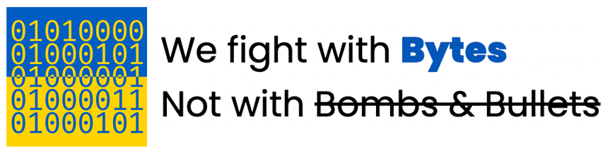

# Stop War Now - The Digital way

URL: https://stopwarnow.github.io/

## What is this?

This site has been inspired by the Ukraine government’s call for IT professionals to help assist against the disruption of Russian propaganda.

Built by Australian Data & Technology professionals, motivated to use their skills to help support the Ukraine, and find a way to allow non-technical people to help support the cause. It is an entirely anonymous and encrypted site that allows anyone with a web browser and internet connectivity to easily participate in disabling and blocking key Russian propaganda sites and services supporting the [Russian invasion of Ukraine](https://en.wikipedia.org/wiki/Russo-Ukrainian_War).

It is open source and 100% transparent and is aiming to help manage the misinformation that the Russian people are being fed.

It is simple. Anyone with a web browser, and internet connectivity can participate and show your support. Simply click the Launch button and leave this running in the background whilst most of us go safely about our days. This tool has been specifically built to only target Russian [pre-defined targets and propaganda sites](./attacklist.csv), and will not interfere with any Russian civilian sites.

All we are donating is our data, of which it requires a minimal outlay, and you are donating in a new way. You can even set the maximum amount of data you want to donate.

## Are there any other ways to help?

Absolutely.
- Please consider donating to the [International Committee of the Red Cross for Ukraine Crisis](https://www.icrc.org/en/donate/ukraine). 
- For other technically inclined people out there who want to contribute please consider joining the [IT Army of Ukraine](https://t.me/itarmyofukraine2022).

## Q&As

### Q: Is this safe?
A: Yes, it does not send any of sensitive data.

### Q: Are you affiliated with any official organisations?
A: No, we are only affiliated with peace and doing the right things.

### Q: Does this consume a lot of data?
A: No, each request sent is minimal. However, you can limit the maximum amount of data you would like to donate to the cause.

### Q: How do I add more targets?
A: Fork, then Submit a pull request with your new target added to `attacklist.csv`.

### Q: Do you collect / sell / share any data?
A: No, we do not know who you are using our tool and we do not share it with any 3rd party.
We do use a tool called [Microsoft Clarity](https://clarity.microsoft.com/) configured with Privacy mode (no Cookie - GDPR compliance) so that we can understand basic stats such as how many people visits the page, all in aggregated mode.

